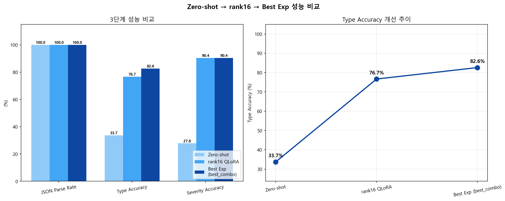
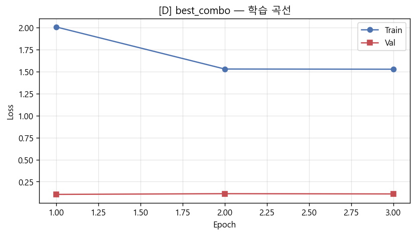
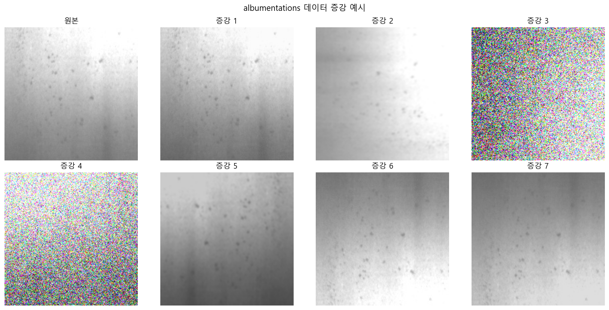
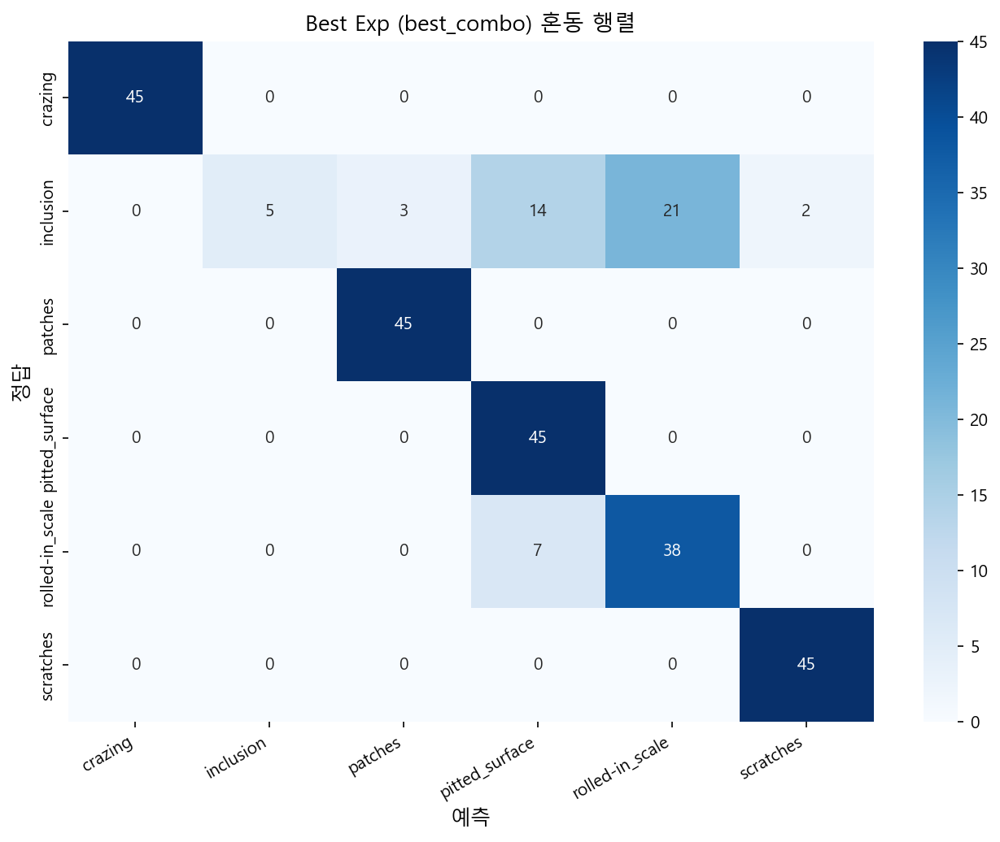

# VLM Defect Inspector

> **Qwen2.5-VL 7B + QLoRA** 기반 금속 표면 불량 자동 분류 시스템  
> NEU Metal Surface Defects 6-class · 소비자 GPU(RTX 4080 Super 16GB)에서 완전 재현 가능

[](https://python.org)
[](https://pytorch.org)
[](LICENSE)

---

## 핵심 성과 — 3단계 개선

| 단계 | Type Accuracy | Severity Acc | JSON Parse | 비고 |
|------|:---:|:---:|:---:|------|
| Zero-shot (베이스라인) | 33.7% | 27.8% | 100% | 파인튜닝 없음 |
| QLoRA rank=16 | 76.7% | 90.4% | 100% | +42.9%p |
| **Best Combo (rank32+aug+smooth)** | **82.6%** | **90.4%** | **100%** | **+48.9%p** |

- 학습 파라미터: **~80M / 7B (1.1%)** — 나머지 frozen
- Best Combo 학습 시간: **약 64분** (RTX 4080 Super)



---

## 시스템 구조

```
이미지 입력 (금속 표면 200×200 grayscale)
        ↓
Qwen2.5-VL 7B  ← 4-bit NF4 양자화 (frozen)
        + LoRA Adapter rank=32 (~80M params)  ← 학습
        ↓
구조화된 불량 리포트 (JSON)
{
  "type": "scratches",
  "type_ko": "스크래치",
  "severity": "high",
  "description": "표면에 선형 스크래치 결함이..."
}
        ↓
FastAPI REST API  /  Gradio 데모  →  Docker 배포
```

---

## 왜 QLoRA인가

7B VLM 풀 파인튜닝은 **~56GB VRAM** 이 필요하다. 소비자 GPU로는 불가능하다.  
QLoRA는 **4-bit NF4 양자화 + LoRA 어댑터**만 학습해 **~8GB VRAM** 으로 해결한다.

```
전체 가중치 (7B) → 4-bit NF4 압축 (frozen)
                         +
            LoRA 어댑터 (q/k/v/o/gate/up/down proj)  ← 이것만 학습
```

성능 손실은 풀 파인튜닝 대비 1~3%p 이내. 비용·접근성 측면에서 실용적인 선택이다.

---

## 데이터셋

**NEU Metal Surface Defects** (공개, Northeastern University)

| 클래스 | 한글명 | 이미지 수 | 심각도 |
|--------|--------|:---------:|:------:|
| crazing | 균열 | 300 | low |
| inclusion | 개재물 | 300 | medium |
| patches | 패치결함 | 300 | low |
| pitted_surface | 피팅 | 300 | high |
| rolled-in_scale | 압연스케일 | 300 | medium |
| scratches | 스크래치 | 300 | high |

- 총 1,800장 → Train/Val/Test = 70/15/15 (stratified split)
- VQA 포맷 변환: 3가지 질문 템플릿 × 3가지 설명 변형으로 다양성 확보

---

## 노트북 구성

| 노트북 | 내용 |
|--------|------|
| `01_dataset.ipynb` | NEU 로드 · EDA · VQA 포맷 변환 · stratified split |
| `02_baseline.ipynb` | Zero-shot 평가 — Type Acc, JSON Parse, F1, 혼동 행렬 |
| `03_finetune.ipynb` | QLoRA 파인튜닝 (4-bit NF4, rank=16, cosine scheduler) |
| `04_evaluation.ipynb` | Before/After 비교 · 클래스별 F1 · 혼동 행렬 분석 |
| `05_experiments.ipynb` | 복합 실험 A/B/C/D — rank32, 데이터 증강, 레이블 스무딩, 얼리스토핑 |

---

## 실험 설계 (05_experiments)

| ID | 변경점 | Best Val Loss | Type Acc |
|----|--------|:---:|:---:|
| A | LoRA rank 16 → 32 | — | — |
| B | albumentations 증강 | — | — |
| C | 레이블 스무딩 0.1 + 얼리스토핑 | — | — |
| **D (Best)** | **A + B + C 통합** | **0.1046** | **82.6%** |



**증강 파이프라인** (Exp B/D): RandomRotate90 · HorizontalFlip · VerticalFlip · RandomBrightnessContrast · GaussNoise · Blur



---

## 혼동 행렬 (Best Combo)



---

## 학습 설정

```python
# 4-bit 양자화
BitsAndBytesConfig(
    load_in_4bit=True, bnb_4bit_quant_type="nf4",
    bnb_4bit_compute_dtype=torch.bfloat16,
    bnb_4bit_use_double_quant=True,
)

# Best Combo LoRA
LoraConfig(
    r=32, lora_alpha=64, lora_dropout=0.05,
    target_modules=["q_proj","k_proj","v_proj","o_proj",
                    "gate_proj","up_proj","down_proj"],
)

# 학습
optimizer  = AdamW8bit(lr=2e-4, weight_decay=0.01)
scheduler  = cosine_with_warmup(warmup_ratio=0.1)
epochs     = 5  # early stopping patience=2
batch_size = 1 + gradient_accumulation=8  (effective=8)
label_smoothing = 0.1
```

---

## 빠른 시작

### 로컬 실행

```bash
# 1. 의존성 설치
pip install -r requirements.txt

# 2. 데이터 준비 (01_dataset.ipynb 실행)
jupyter notebook notebooks/01_dataset.ipynb

# 3. 순서대로 노트북 실행
#    02_baseline → 03_finetune → 04_evaluation → 05_experiments

# 4. Gradio 데모
python demo.py

# 5. API 서버
uvicorn app.main:app --host 0.0.0.0 --port 8000
```

### Docker 실행

```bash
docker-compose up --build
```

---

## API 엔드포인트

| 메서드 | 경로 | 설명 |
|--------|------|------|
| GET | `/health` | 서버 상태 + 모델 정보 |
| POST | `/inspect` | 이미지 파일 업로드 → 불량 분류 |
| POST | `/inspect/base64` | Base64 이미지 → 불량 분류 |

Swagger UI: `http://localhost:8000/docs`

**응답 예시:**
```json
{
  "type": "scratches",
  "type_ko": "스크래치",
  "severity": "high",
  "description": "표면에 선형 스크래치 결함이 관찰됩니다.",
  "confidence": "high",
  "elapsed_ms": 420.3,
  "model": "Qwen2.5-VL-7B + QLoRA best_combo"
}
```

---

## 기술 스택

`Qwen2.5-VL` · `QLoRA` · `PEFT` · `bitsandbytes` · `albumentations` · `PyTorch` · `FastAPI` · `Gradio` · `Docker`

---

## 관련 레포

- [autonomous-cv-pipeline](https://github.com/MJHolics/autonomous-cv-pipeline) — TensorRT FP16 + QLoRA 자율주행 파이프라인
- [multimodal-rag](https://github.com/MJHolics/multimodal-rag) — BGE-M3 + Qwen2.5-VL 기술문서 RAG
